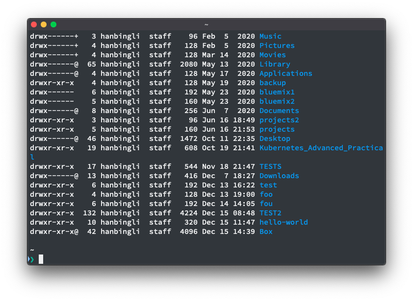

# hello-world
### Scope
This is my first try for GigHub
for the easy use
purpose `git status`

the first step here.
I am new to this site.

for tracking what I am using
and need to change 

this is another line
the last line

from repo
